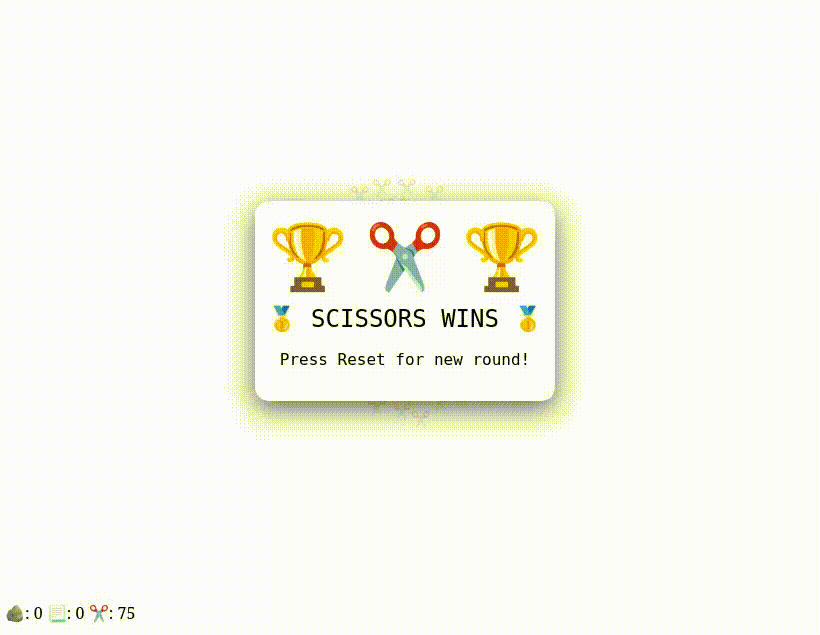
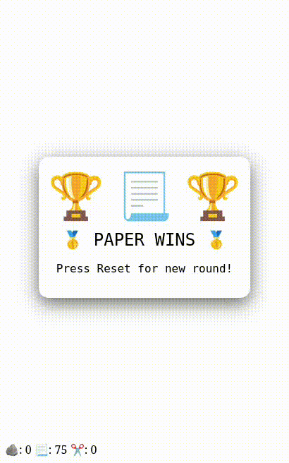
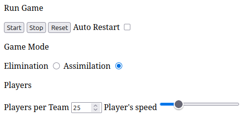

# ✂️📃🪨 Jokenpo Swarm Simulator

A self-playing Rock–Paper–Scissors game prototype built with JavaScript + HTML5 Canvas where tens of autonomous agents battle using simple AI rules.
Out of chaos emerges strategy, patterns, and beautiful visual swarms.

No player input — just sit back and watch ✨


## 🎮 Demo

Each round:

- Three teams (✂️ Scissors, 📃 Paper, 🪨 Rock) spawn randomly
- Every unit decides:
    - **Who to chase**
    - **Who to flee**
    - **When to regroup**
- The last surviving team wins
- The game restarts automatically

Emergent behavior makes every round unique.


## 🧠 AI Rules

Each agent follows three simple rules:

1. **Move away from the closest threat**
    (an enemy that can defeat it)
2. **Move toward the closest target**
    (an enemy it can defeat)
3. **If nothing is nearby, move toward the center**
    (keeps the swarm active and clustered)

These minimal rules create complex, lifelike motion.


## 🖥 Desktop vs 📱 Mobile

The game adapts automatically:

| Device  | Arena Size                                  |
| ------- | ------------------------------------------- |
| Desktop | `800 × 600`                                 |
| Mobile  | Up to `480px` wide, `~60%` of screen height |

On mobile the canvas is centered and leaves space for controls below.


## 🧩 Features

- Emoji-based agents ✂️📃🪨
- Smooth AI movement & flocking
- Soft collision & bounce system
- Real Rock–Paper–Scissors combat
- Automatic round restart
- Mobile-friendly responsive layout
- No libraries — 100% vanilla JS


## 📁 Project Structure

```bash
/JOKENPO-JS/
├── js/
│   ├── game.js
│   ├── main.js
│   ├── player.js
│   └── utils.js
├── .gitignore
├── index.html
├── LICENSE
└── README.md
```


## ▶️ How to Run

No build tools needed.
Just open:

```bash
index.html
```

in any modern browser.

Works on:
- Chrome
- Firefox
- Safari
- Mobile browsers


## 📸 Game Preview

Desktop size canvas:



Mobile size canvas:




## 🛠 Tuning the Simulation

Basic HTML buttons change the configurations of the simulation:



Change the controllers in the `Game Mode` and `Players` sections to:
- Change game mode:
    - Elimination (one player removes the other)
    - Assimilation (one player changes the type of the other)
- Change the size of the teams (1 to 100)
- Changes player's speed


## 📜 License

MIT — do whatever you want.


## ❤️ Credits

Created as an experiment in:
Simple rules → complex behavior

If you enjoy it, give the repo a ⭐